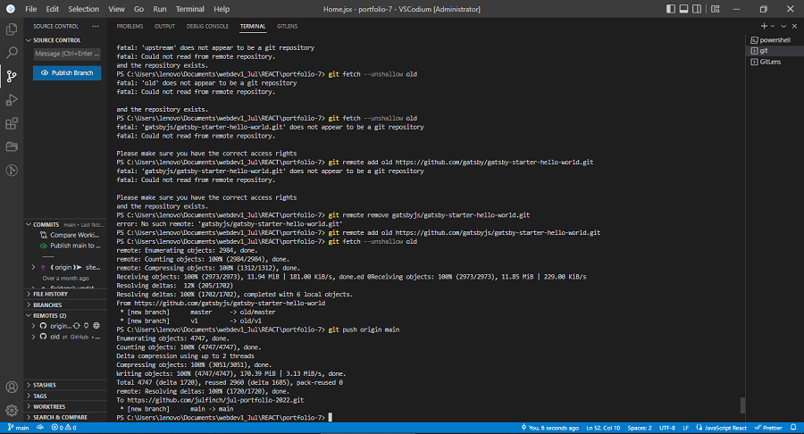
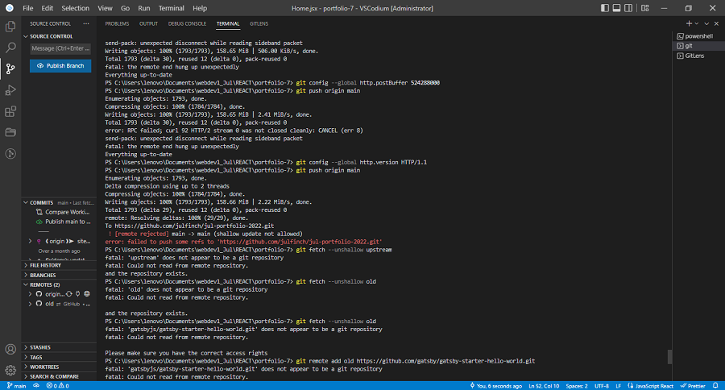
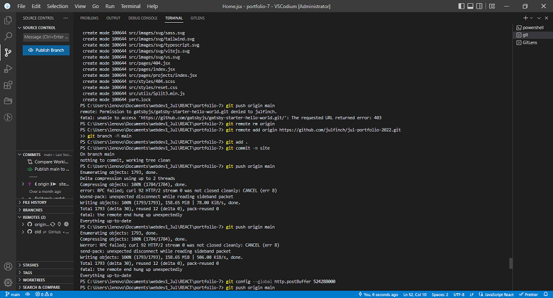
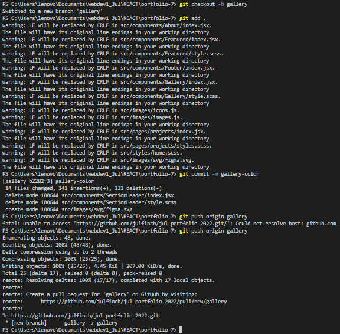

# Jul Danreb Lactao Portfolio Website
  -Live Site URL: [https://jul-lactao.netlify.app/](https://jul-lactao.netlify.app/)

  -This website is a showcase portfolio that exhibits my web development skills in using React. For this project, I used Gatsby and applied Javascript animations for the interactions using Greensock(GSAP) and Framer Motion. As for my CSS styling, I used Sass and to achieve a more professional-looking portfolio website, I also applied Locomotive-Scroll and Smooth-Scroll.
  
## Table of contents

- [Overview](#overview)
  - [Screenshot](#screenshot)
  - [Links](#links)
- [My Process](#process)
  - [Install Dependencies](#dependencies)
  - [Additional Info](#additional-info)
  - [Errors](#errors)
  - [Built With](#built-with)
- [Author](#author)

## Overview

### Screenshot


### Links

  -Live Site URL: [https://jul-lactao.netlify.app/](https://jul-lactao.netlify.app/)

## My Process
1.  **Create a Gatsby site.**

    Use the Gatsby CLI ([install instructions](https://www.gatsbyjs.com/docs/tutorial/part-0/#gatsby-cli)) to create a new site, specifying the hello-world starter.

    ```shell
    # create a new Gatsby site using the hello-world starter
    gatsby new my-hello-world-starter https://github.com/gatsbyjs/gatsby-starter-hello-world
    ```

1.  **Start developing.**

    Navigate into your new site’s directory and start it up.

    ```shell
    cd my-hello-world-starter/
    gatsby develop
    ```

1.  **Open the source code and start editing!**

    Your site is now running at `http://localhost:8000`!

    _Note: You'll also see a second link: _`http://localhost:8000/___graphql`_. This is a tool you can use to experiment with querying your data. Learn more about using this tool in the [Gatsby Tutorial](https://www.gatsbyjs.com/docs/tutorial/part-4/#use-graphiql-to-explore-the-data-layer-and-write-graphql-queries)._

    Open the `my-hello-world-starter` directory in your code editor of choice and edit `src/pages/index.js`. Save your changes and the browser will update in real time!


### Install Dependencies

```js
"dependencies": {
    "classnames": "^2.3.1",
    "eslint": "^8.20.0",
    "framer-motion": "^6.5.1",
    "gatsby": "^4.19.2",
    "gatsby-plugin-gatsby-cloud": "^4.19.0",
    "gatsby-plugin-image": "^2.19.0",
    "gatsby-plugin-less": "^6.19.0",
    "gatsby-plugin-manifest": "^4.19.0",
    "gatsby-plugin-offline": "^5.19.0",
    "gatsby-plugin-react-helmet": "^5.19.0",
    "gatsby-plugin-sass": "^5.19.0",
    "gatsby-plugin-sharp": "^4.19.0",
    "gatsby-source-filesystem": "^4.19.0",
    "gatsby-transformer-sharp": "^4.19.0",
    "gsap": "^3.10.4",
    "less": "^4.1.3",
    "less-loader": "^11.0.0",
    "locomotive-scroll": "^4.1.4",
    "prop-types": "^15.8.1",
    "react": "^18.1.0",
    "react-dom": "^18.1.0",
    "react-helmet": "^6.1.0",
    "react-icons": "^4.4.0",
    "react-loadable": "^5.5.0",
    "sass": "^1.54.0",
    "sharp": "0.30.7",
    "smooth-scrollbar": "^8.7.5"
  },
```

### Additional Info

**GATSBY-CONFIG.JS**
```js
	module.exports = {
  /* Your site config here */
  siteMetadata: {
    title: `Jul Danreb Lactao`,
    description: `React Portfolio Website of Jul Danreb Lactao`,
  },
  plugins: [
    {
      resolve: `gatsby-source-filesystem`,
      options: {
        name: `images`,
        path: `${__dirname}/src/images/`,
      },
    },
    `gatsby-plugin-image`,
    `gatsby-plugin-sharp`,
    `gatsby-transformer-sharp`,
    {
    resolve: "gatsby-plugin-less",
    options: {
      javascriptEnabled: true,
    },
  },
    `gatsby-plugin-less`,
    `gatsby-plugin-sass`,
    {
      resolve: `gatsby-plugin-less`,
      options: {
        loaderOptions: {
          appendData: `@env: ${process.env.NODE_ENV};`,
        },
        javascriptEnabled: true,
        modifyVars: {
          "primary-color": "#00BFA6",
        },
      },
    },
  ],
}
```
---

### Errors

- ** [remote rejected] main -> main (shallow update not allowed) error: failed to push some refs t**



- **Removing Gastby-Starter as old repo then adding my own portfolio-2022 repo as new **


- **Continuos development: creating new branch**


---

### Built with

- Semantic HTML5 markup
- SASS
- ReactJS
- Gatsby
- GSAP
- Framer Motion

---
 
## Author

- Twitter - [@julfinch](https://www.twitter.com/julfinch)
